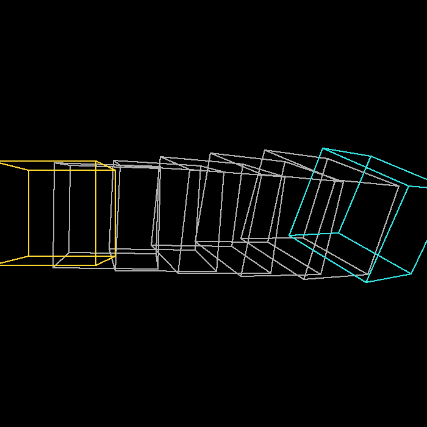

# 计算机图形学实验二：MVP 矩阵变换

基于 Taichi 实现的 MVP（模型-视图-投影）矩阵变换，把三维坐标完整地走一遍渲染管线，最终画到 700×700 的窗口上。

## 演示效果

### 基础任务：彩色三角形旋转


顶点坐标 (2,0,−2)、(0,2,−2)、(−2,0,−2)，位于 z=−2 平面。三条边做颜色插值，按 A/D 键控制旋转方向。

### 进阶任务：立方体透视旋转


中心在原点的单位立方体同时绕 X、Y、Z 三轴旋转。透视效果让近处的边看起来更大，后面的边（蓝色系）和前面的边（红色系）在视觉上有明显区别。

### 扩展任务：旋转插值（SLERP）



同时渲染两个不同姿态的立方体，并用**四元数球面线性插值（SLERP）**展示从姿态 A 到姿态 B 的平滑过渡路径：

- **蓝色（左）**：姿态 A，初始位置，无旋转
- **青色（右）**：姿态 B，绕 X 轴 25°、绕 Y 轴 45°，平移至右侧
- **灰色（中间）**：SLERP 路径上 5 个均匀采样的中间姿态（幽灵帧）
- **金色**：沿插值路径自动往复运动的动画立方体

旋转用四元数表示并做球面插值，位置做线性插值，两者同步推进参数 $t \in [0,1]$，实现空间中两个姿态之间的最短弧路径过渡。

## 原理

三维物体显示到屏幕要经过三次变换，按顺序相乘：

```text
MVP = Projection @ View @ Model
```

**Model**：旋转物体，绕 Z 轴旋转角度 θ 的矩阵：

```text
| cos θ  -sin θ   0   0 |
| sin θ   cos θ   0   0 |
|   0       0     1   0 |
|   0       0     0   1 |
```

**View**：把相机平移到原点，相机在 (ex, ey, ez)：

```text
| 1  0  0  -ex |
| 0  1  0  -ey |
| 0  0  1  -ez |
| 0  0  0   1  |
```

**Projection**：两步走——先把视锥体挤压成长方体（透视→正交），再正交投影到 NDC。

按右手系约定，相机朝 −Z 看，近平面 n = −zNear，远平面 f = −zFar。

透视→正交矩阵：

```text
| n  0    0    0  |
| 0  n    0    0  |
| 0  0   n+f   1  |
| 0  0  -n·f   0  |
```

视锥体边界由 FOV 和近平面距离推导：t = tan(FOV/2)·|n|，b=−t，r=aspect·t，l=−r。

最后做**透视除法**（齐次坐标归一化）再映射到屏幕像素：

```python
v /= v[3]                               # 透视除法
screen_x = (v[0] + 1.0) * width  / 2.0
screen_y = (v[1] + 1.0) * height / 2.0
```

## 环境配置

项目用 [uv](https://docs.astral.sh/uv/) 管理依赖，Python 3.8+。

```bash
# 安装 uv（如果还没有）
pip install uv

# 同步依赖（自动创建 .venv）
uv sync
```

如果只想用 pip：

```bash
pip install -r requirements.txt
```

依赖：`taichi>=1.6.0`、`numpy>=1.24.0`、`pillow>=10.0.0`

## 运行

### 三角形

```bash
uv run python main.py
```

| 按键  | 操作       |
| ----- | ---------- |
| `A`   | 逆时针旋转 |
| `D`   | 顺时针旋转 |
| `ESC` | 退出       |

### 立方体

```bash
uv run python cube.py
```

| 按键    | 操作                                    |
| ------- | --------------------------------------- |
| `W / S` | 绕 X 轴旋转                             |
| `A / D` | 绕 Y 轴旋转                             |
| `Q / E` | 绕 Z 轴旋转                             |
| `空格`  | 切换自动旋转                            |
| `I`     | 切换插值模式（SLERP 在两固定姿态间往复） |
| `ESC`   | 退出                                    |

### 旋转插值可视化

```bash
uv run python interp_cube.py
```

同屏显示姿态 A、姿态 B 及其插值路径。

| 按键   | 操作         |
| ------ | ------------ |
| `空格` | 暂停/继续动画 |
| `ESC`  | 退出         |

### 重新生成演示 GIF

```bash
uv run python demo_generator.py
```

输出三个 GIF：

| 文件 | 内容 | 帧数 |
| ---- | ---- | ---- |
| `triangle_demo.gif` | 三角形旋转 | 72 帧 |
| `cube_demo.gif` | 立方体三轴旋转 | 90 帧 |
| `interp_demo.gif` | 双姿态 SLERP 插值路径 | 120 帧 |

## 代码结构

```text
实验二/
├── main.py              # 三角形：MVP 变换 + 交互渲染
├── cube.py              # 立方体：三轴旋转 + 交互渲染（含 SLERP 插值模式）
├── interp_cube.py       # 旋转插值可视化：双姿态 + 幽灵帧 + 动画立方体
├── demo_generator.py    # 离线生成演示 GIF（独立实现，不依赖 main/cube）
├── triangle_demo.gif    # 三角形演示动画
├── cube_demo.gif        # 立方体演示动画
├── interp_demo.gif      # 旋转插值演示动画
├── pyproject.toml       # uv 项目配置
├── requirements.txt     # pip 兼容依赖列表
├── .gitignore
└── README.md
```

### 核心函数

**`main.py` / `cube.py`**

`get_model_matrix(angle)` — 绕 Z 轴旋转矩阵（角度制输入）

`get_view_matrix(eye_pos)` — 将相机平移至原点的视图矩阵

`get_projection_matrix(fov, aspect, zNear, zFar)` — 透视投影矩阵，先挤压后正交

`transform_and_draw(angle, pixels)` — 执行完整 MVP 变换并用 Bresenham 算法绘制线框

**`interp_cube.py`**

`euler_to_quat(ax, ay, az)` — 欧拉角（ZYX 顺序）转单位四元数

`quat_slerp(qa, qb, t)` — 球面线性插值，自动选最短弧路径

`quat_to_mat4(q)` — 四元数转 4×4 旋转矩阵

`xform_cube_to_slot(slot, q, tx, ty, tz)` — 将指定姿态的立方体变换结果写入 NDC 缓冲槽

## 常见问题

**画面是黑的，什么都没有？**

相机默认在 (0, 0, 5)。如果把 zNear 改得很大（比如 10），视锥体就把物体截掉了。三角形在 z=−2，立方体在原点附近，相机距离设 5 就够了。

**旋转方向和直觉相反？**

右手坐标系正角度对应逆时针（从 +Z 往下看）。把 `angle += 1.0` 和 `angle -= 1.0` 对调就能反向。

**FOV 怎么调？**

在 `main.py` 和 `cube.py` 里找 `get_projection_matrix(45.0, ...)` 改第一个参数。90° 有广角畸变感，20° 以下接近正交投影，空间纵深几乎消失。

**能再加物体吗？**

定义新的顶点 field 和边 field，在绘制循环里套同一套 MVP 变换逻辑就行。

**SLERP 和 LERP 插值旋转有什么区别？**

LERP（线性插值）直接对旋转矩阵或欧拉角插值，会导致中间帧速度不均匀、旋转轴漂移。SLERP 在四元数空间的单位超球面上按等角速度插值，保证最短路径、恒定角速度，是动画中旋转过渡的标准方法。

## 参考

- [GAMES101 现代计算机图形学入门](https://sites.cs.ucsb.edu/~lingqi/teaching/games101.html)（闫令琪）
- [Taichi 文档](https://docs.taichi-lang.org/)
- [Learn OpenGL - Coordinate Systems](https://learnopengl.com/Getting-started/Coordinate-Systems)
